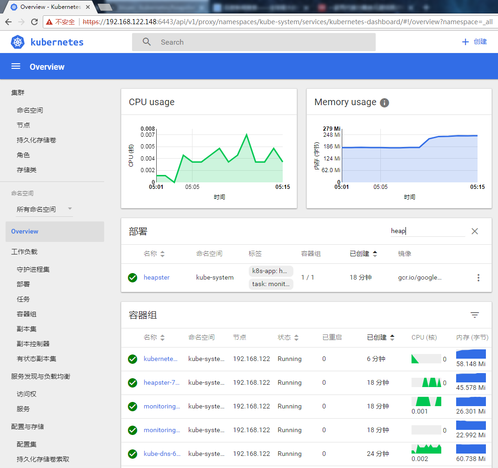
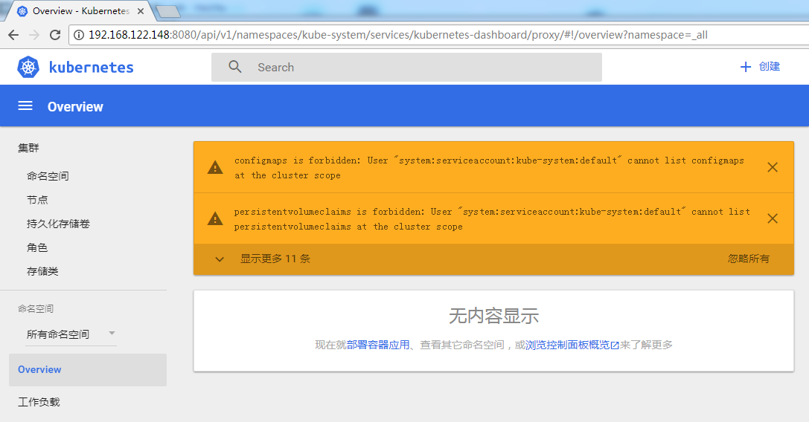

### dashboard插件

>经过前面的k8s 1.8.4安装之后，继续安装dashboard插件...

	cd /home/kubernetes/kubernetes/cluster/addons/dashboard
	[root@localhost dashboard]# ls
	dashboard-controller.yaml  dashboard-service.yaml  MAINTAINERS.md  README.md
	[root@localhost dashboard]# 

官方没有rbac.yaml这个文件，自己创建~~

新加了 dashboard-rbac.yaml 文件，定义 dashboard 使用的 RoleBinding

查看需要使用的镜像：

	gcr.io/google_containers/kubernetes-dashboard-amd64:v1.6.3

	docker pull registry.cn-hangzhou.aliyuncs.com/google-containers/kubernetes-dashboard-amd64:v1.6.3

	docker tag registry.cn-hangzhou.aliyuncs.com/google-containers/kubernetes-dashboard-amd64:v1.6.3 gcr.io/google_containers/kubernetes-dashboard-amd64:v1.6.3

创建：

	[root@localhost dashboard]# kubectl create -f dashboard-controller.yaml 
	deployment "kubernetes-dashboard" created
	[root@localhost dashboard]# kubectl create -f dashboard-service.yaml 
	service "kubernetes-dashboard" created
	[root@localhost dashboard]# 

显示：

### 通过Https访问面板

验证客户端是否有效：

	kubectl --server=https://192.168.122.148:6443 --insecure-skip-tls-verify=true --client-certificate=/etc/kubernetes/ssl/kubelet-client.crt --client-key=/etc/kubernetes/ssl/kubelet-client.key get nodes

>后面的heapster貌似不能加载出cpu，内存等信息，所以还是先用Https访问吧

修改apiserver:

	KUBE_API_ADDRESS="--advertise-address=192.168.122.148 --insecure-bind-address=192.168.122.148 --bind-address=192.168.122.148"

修改/etc/kubernetse/config中的
变成：

	KUBE_MASTER="--master=https://127.0.0.1:8080"

重启服务：

	./zk8s_run.sh restart #该脚本已包含在github中

>https://192.168.122.148:6443/api/v1/proxy/namespaces/kube-system/services/kubernetes-dashboard

打开出现：

	{
	  "kind": "Status",
	  "apiVersion": "v1",
	  "metadata": {
	    
	  },
	  "status": "Failure",
	  "message": "services \"kubernetes-dashboard\" is forbidden: User \"system:anonymous\" cannot proxy services in the namespace \"kube-system\"",
	  "reason": "Forbidden",
	  "details": {
	    "name": "kubernetes-dashboard",
	    "kind": "services"
	  },
	  "code": 403
	}

解决：

	cd /etc/kubernetes/ssl
	openssl pkcs12 -export -in admin.pem  -out admin.p12 -inkey admin-key.pem
	#输入密码，如: 123456,将生成一个新文件admin.p12

将生成的admin.p12证书导入的你的电脑，导出的时候记住你设置的密码，导入的时候还要用到

导入证书之后，即可打开：

	https://192.168.122.148:6443/api/v1/proxy/namespaces/kube-system/services/kubernetes-dashboard/#!/overview?namespace=default
		

如想要在master正常使用Kubectl命令，[查看此链接](https://github.com/zouhuigang/kubernetes/blob/master/k8s_1.8.4/heapster/kubectl.md)

### 安装好kube-dns和heapster之后，dashboard显示的图像如下：

### 问题汇总：

Q1：访问,出现roles.rbac.authorization.k8s.io is forbidden: User "system:serviceaccount:kube-system:default" cannot list roles.rbac.authorization.k8s.io at the cluster scope

A1：出现这个问题是：

因为在dashboard-controller.yaml 中没有指定rbac用户：

	 spec:
	      serviceAccountName: dashboard  #指定用户
	      containers:
	      - name: kubernetes-dashboard
	        image: gcr.io/google_containers/kubernetes-dashboard-amd64:v1.6.3

[https://github.com/kubernetes/dashboard/issues/1803](https://github.com/kubernetes/dashboard/issues/1803)

	

Q2:如果安装了kube-dns和heapster，发现还是没有图像等信息，容器也没异常报错等情况出现。

A2：删除并重新创建下dashboard面板即可！

由于缺少 Heapster 插件，当前 dashboard 不能展示 Pod、Nodes 的 CPU、内存等 metric 图形；

